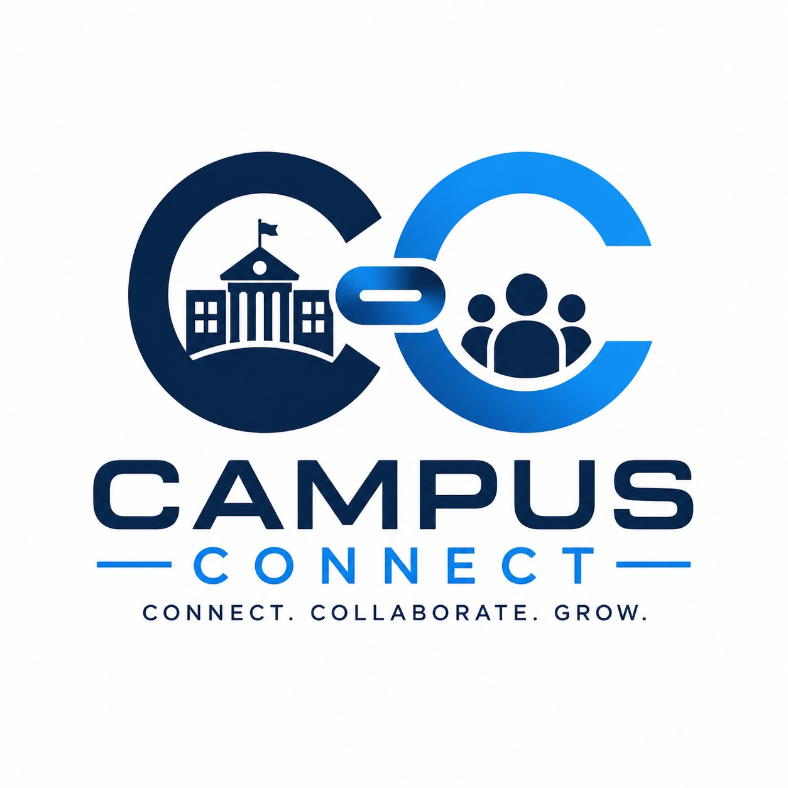

# Campus Connect - A Centralized Problem Reporting and Resolution Portal 

### Automated Multi-Role Campus Problem Reporting & Resolution Portal

<p align="center">
  
</p>

<p align="center">
  <strong>Report. Assign. Resolve. Verify.</strong>
</p>

<p align="center">
  A modern frontend prototype for centralized campus complaint management, multi-role task assignment, resolution tracking, verification, and transparency.
</p>

---

## 📌 About the Project

**Campus Connect** is a modern web-based campus problem reporting and resolution portal designed to provide a structured workflow for handling problems reported within an educational institution.

Instead of relying on informal communication, students can submit problems through a centralized interface. The complaint then moves through multiple responsible roles including **Admin, Faculty, and Technician** until the issue is completed and verified.

The current implementation is a **frontend prototype with browser-based persistent state**, designed to demonstrate the complete application workflow and user experience without requiring a backend server.

---

## 🎯 Project Vision

Campus Connect aims to create a clear chain of responsibility for every campus problem.

```text
Student
   ↓
Complaint Submission
   ↓
Admin Verification
   ↓
Department Assignment
   ↓
Faculty Assignment
   ↓
Technician Action
   ↓
Work Completion
   ↓
Proof Submission
   ↓
Faculty Verification
   ↓
Admin Final Verification
   ↓
Completed
   ↓
Student Feedback
```

The goal is simple:

> **Every problem should have a responsible person, a visible status, and a documented resolution.**

---

# ✨ Key Features

## 👨‍🎓 Student Workspace

Students can:

* Submit new complaints.
* Select complaint categories.
* Add detailed descriptions.
* Specify problem locations.
* Upload supporting images.
* Upload optional video evidence.
* View their submitted complaints.
* Track complaint progress.
* View complaint timelines.
* View assigned technicians.
* View deadlines.
* View resolution information.
* Access profile information.
* Submit feedback after completion.

---

## 🛡️ Admin Workspace

The Admin dashboard provides centralized control over the complaint system.

### Admin capabilities

* View overall complaint statistics.
* Review incoming complaints.
* Verify submitted complaints.
* Assign complaints to departments.
* Monitor complaint progress.
* Monitor department performance.
* View complaint details.
* View complaint activity logs.
* Monitor completed complaints.
* Review resolution performance.
* View analytics and charts.
* Manage system-level information.

---

## 👨‍🏫 Faculty / Department Workspace

Faculty members act as the departmental coordinator between administration and technicians.

### Faculty capabilities

* View department-specific complaints.
* Review assigned complaints.
* Assign technicians.
* Set deadlines.
* Monitor technician activity.
* Track task progress.
* Review completed work.
* Review technician proof.
* Verify completed work.
* Provide QA feedback.
* Forward verified work toward final closure.

---

## 🔧 Technician Workspace

Technicians are responsible for completing the physical or technical work.

### Technician capabilities

* View assigned work orders.
* Review complaint details.
* Accept assigned tasks.
* Reject tasks when necessary.
* Provide rejection reasons.
* View deadlines.
* Update work progress.
* Complete assigned work.
* Upload work proof.
* Add completion remarks.
* Submit completed work for faculty verification.

---

# 🔄 Complete Complaint Resolution Workflow

Campus Connect implements a structured multi-stage workflow.

### Stage 1: Complaint Submitted

The student reports a problem by providing relevant information such as:

* Title
* Category
* Description
* Location
* Priority
* Image
* Optional video

The system generates a complaint/ticket identifier.

---

### Stage 2: Admin Verification

The administrator reviews the complaint and verifies the submitted information.

After verification, the complaint is routed to the appropriate department.

---

### Stage 3: Faculty Assignment

The department faculty member reviews the complaint and assigns it to a suitable technician.

A deadline can also be defined.

---

### Stage 4: Technician Action

The technician receives the assigned work order.

The technician can:

* Accept the task
* Reject the task

If rejected, a rejection reason is recorded.

The workflow supports technician reassignment when required.

---

### Stage 5: Work Completion

After accepting the task, the technician performs the required work.

The technician can submit:

* Completion status
* Work remarks
* Proof photograph

The completed work is then sent to the faculty member for verification.

---

### Stage 6: Faculty Verification

Faculty reviews the submitted work and proof.

The faculty member can verify the work and provide QA feedback.

---

### Stage 7: Admin Final Verification

The administrator performs the final verification and closes the complaint.

The completed complaint remains available as part of the system's resolution history.

---

# 🚨 Priority Detection

The application includes keyword-based priority detection.

Certain critical keywords can automatically identify potentially high-priority complaints.

Examples include:

* Open wire
* Naked wire
* Short circuit
* Current shock
* Sparks
* Hazard
* Fire sparks
* Wire spark

Medium-priority keywords include examples such as:

* Fan
* Tubelight
* Flicker
* Light off
* Projector flickering
* Bench broken

This mechanism helps demonstrate how complaints can be categorized based on the severity of their descriptions.

---

# 📊 Dashboard & Analytics

The Admin workspace includes visual analytics for monitoring the complaint system.

The dashboard provides information such as:

* Total complaints
* Completed complaints
* Resolution rate
* Average satisfaction
* Staff information
* Department-wise complaint distribution
* Complaint status distribution
* Complaint analytics

Charts are rendered using **Chart.js**.

---

# 🌐 Public Transparency Feed

Campus Connect also includes a dedicated public feed.

The transparency feed provides a simplified view of complaint activity and resolution information.

This module is designed to demonstrate how institutions can provide greater visibility into campus maintenance and problem resolution.

---

# 🎨 User Interface

The interface is designed around a modern dashboard-oriented visual system.

### Design characteristics

* Responsive layouts
* Light mode
* Dark mode
* Aurora-style backgrounds
* Glassmorphism elements
* Modern cards
* Animated interactions
* Smooth transitions
* Responsive navigation
* Interactive dashboards
* Modal-based workflows
* Image previews
* Lightbox image viewing
* Toast notifications
* Progress indicators
* Status badges
* Role-specific dashboards

---

# 🌗 Light & Dark Mode

Campus Connect supports both:

* Light Mode
* Dark Mode

The selected theme is stored in browser local storage so that the user's preference can persist across sessions.

The application also checks the user's system color preference when no saved theme is available.

---

# 🔐 Session & Authentication Prototype

The current frontend includes a role-based authentication prototype.

Supported roles:

* Student
* Faculty
* Technician
* Admin

The application uses browser-side state and local storage for the current prototype.

> **Important:** This is frontend authentication for demonstration purposes. It should not be considered production-grade authentication until connected to a secure backend.

---

# 💾 Data Persistence

The current prototype uses the browser's **localStorage** to persist application state.

The application stores information related to:

* Users
* Faculties
* Technicians
* Complaints
* Sessions
* Theme preference
* Notifications
* Complaint activity
* Workflow information

This allows the frontend prototype to maintain state between page refreshes without requiring a database server.

---

# 🧪 Seeded Demo Data

The project includes pre-configured demonstration data for multiple departments and roles.

### Departments

* Computer Department
* Electrical Department
* Mechanical Department
* Civil Department

### Demo Students

* Kabir Mehta
* Ananya Iyer
* Rohan Verma
* Priya Sharma

### Demo Technicians

* Dilip Prasad
* Jagdish Panchal
* Ankit Sharma
* Madan Lal

The seeded complaints demonstrate different workflow states such as:

* Assigned to Faculty
* Work in Progress
* Work Completed by Technician
* Faculty Verified
* Completed

This makes the project immediately suitable for demonstrations and presentations.

---

# 🧩 Project Structure

```text
Campus---Connect/
│
├── assets/
│   ├── images/
│   │   ├── bg.png
│   │   ├── campus-bg.jpg
│   │   └── campus-bg.png
│   │
│   └── logo/
│       └── logo.png
│
├── css/
│   ├── feed.css
│   ├── home.css
│   ├── login.css
│   ├── portal.css
│   ├── roles.css
│   └── style.css
│
├── js/
│   ├── animations.js
│   ├── feed.js
│   ├── login.js
│   ├── main.js
│   ├── navigation.js
│   ├── portal.js
│   └── roles.js
│
├── scratch/
│   ├── full_suite.js
│   └── validate_workflow.js
│
├── feed.html
├── index.html
├── login.html
├── portal.html
├── roles.html
├── bg.png
├── logo.png
├── .gitignore
└── README.md
```

---

# 📄 Main Pages

## `index.html`

The main landing page of Campus Connect.

It introduces the system and provides navigation into the different sections of the application.

---

## `login.html`

Provides role-based login interfaces for:

* Student
* Faculty
* Technician
* Admin

---

## `portal.html`

Provides the complaint submission and resolution portal.

The portal supports complaint information, media uploads, priority detection, and complaint creation.

---

## `roles.html`

Contains the role-specific workspaces and dashboards.

This is the primary operational interface for:

* Student
* Faculty
* Technician
* Admin

---

## `feed.html`

Provides the public transparency feed for viewing complaint and resolution information.

---

# 🧠 JavaScript Architecture

The application is divided into several JavaScript modules.

### `main.js`

Contains core application state and shared functionality including:

* Seed database
* Application state
* Session management
* Local storage
* Notifications
* Theme management
* Profile management
* Utility functions
* Complaint normalization
* Shared UI functionality

---

### `portal.js`

Controls the complaint submission workflow.

Responsibilities include:

* Complaint modal
* Keyword detection
* Priority detection
* Image upload
* Video upload
* Proof handling
* Complaint creation
* Complaint validation

---

### `login.js`

Controls role-based login and registration functionality.

---

### `roles.js`

Contains the majority of role-specific dashboard logic.

It manages:

* Student dashboard
* Faculty dashboard
* Technician dashboard
* Admin dashboard
* Complaint assignment
* Technician actions
* Rejection workflow
* Work completion
* Faculty verification
* Admin verification
* Analytics
* Complaint rendering

---

### `feed.js`

Controls the public complaint transparency feed and filtering functionality.

---

### `navigation.js`

Handles navigation and shared navigation behavior.

---

### `animations.js`

Provides frontend animation and interaction behavior.

---

# 🛠️ Technologies Used

| Technology           | Purpose                       |
| -------------------- | ----------------------------- |
| HTML5                | Application structure         |
| CSS3                 | Custom styling and animations |
| JavaScript           | Application logic             |
| Tailwind CSS CDN     | Utility-based UI styling      |
| Font Awesome         | Icons                         |
| Google Fonts         | Typography                    |
| Chart.js             | Dashboard analytics           |
| Browser localStorage | Client-side persistence       |
| Git                  | Version control               |
| GitHub               | Repository and collaboration  |

---

# 🚀 Getting Started

Because this version is a frontend application, no backend server or database installation is required to run the current prototype.

## Option 1: Open Directly

Download or clone the repository and open:

```text
index.html
```

in a modern web browser.

---

## Option 2: Run Using VS Code Live Server

### Step 1

Open the project folder in Visual Studio Code.

### Step 2

Install the **Live Server** extension if it is not already installed.

### Step 3

Right-click:

```text
index.html
```

and select:

```text
Open with Live Server
```

The application will open in the browser.

---

# 💻 Recommended Environment

For the best experience:

* Google Chrome
* Microsoft Edge
* Mozilla Firefox
* Visual Studio Code
* Live Server extension

A modern browser with JavaScript enabled is required.

---

# 🧪 Testing & Validation

The project contains dedicated JavaScript-based workflow validation scripts inside the `scratch/` directory.

## `validate_workflow.js`

This script validates:

* JavaScript syntax
* Core application module loading
* Student complaint submission
* Admin verification
* Faculty assignment
* Technician rejection
* Technician reassignment
* Technician acceptance
* Work completion
* Faculty QA verification
* Admin final completion

---

## `full_suite.js`

The comprehensive test suite is designed to simulate the complete multi-stage complaint workflow using a mocked browser environment.

It verifies important application behavior without requiring a live backend.

---

# 🔬 End-to-End Workflow Testing

The project includes testing for a workflow similar to:

```text
Student Files Complaint
        ↓
Admin Verifies Complaint
        ↓
Faculty Receives Complaint
        ↓
Faculty Assigns Technician
        ↓
Technician Rejects / Accepts
        ↓
Technician Reassignment if Required
        ↓
Technician Accepts
        ↓
Work in Progress
        ↓
Technician Completes Work
        ↓
Proof Submitted
        ↓
Faculty QA Verification
        ↓
Admin Final Verification
        ↓
Complaint Completed
```

This makes the prototype suitable for demonstrating not only UI functionality but also the intended business workflow.

---

# 📸 Screenshots

Recommended screenshots for the repository:

* Landing Page
* Login Interface
* Student Dashboard
* Complaint Submission Modal
* Complaint Tracking
* Faculty Dashboard
* Technician Dashboard
* Admin Dashboard
* Analytics
* Public Transparency Feed
* Dark Mode
* Light Mode
* Complaint Timeline
* Work Proof Verification

Store screenshots inside a dedicated folder such as:

```text
screenshots/
```

and reference them from this README.

---

# 🔮 Future Development

The current implementation is intentionally frontend-focused. The next major development phase can transform the prototype into a production-ready full-stack system.

### Backend

Potential backend stack:

* Node.js
* Express.js
* MongoDB
* Mongoose
* REST APIs

### Authentication

The frontend prototype can later be replaced with secure server-side authentication using:

* JWT
* bcrypt
* Role-based access control
* Protected API routes
* Secure session handling

### File Storage

Uploaded complaint images, videos, and proof documents can be moved from browser memory/localStorage to proper cloud or server-side storage.

### Database

The current localStorage state can be migrated into collections such as:

```text
Users
Departments
Technicians
Complaints
ComplaintLogs
Feedback
Notifications
```

### Notifications

Future versions can support:

* Email notifications
* In-app notifications
* Push notifications
* Assignment notifications
* Resolution notifications

---

# 📈 Production Roadmap

```text
Current Prototype
       │
       ▼
Frontend Validation
       │
       ▼
Backend API
       │
       ▼
MongoDB Database
       │
       ▼
Secure Authentication
       │
       ▼
Cloud File Storage
       │
       ▼
Notification System
       │
       ▼
Production Deployment
```

---

# ⚠️ Current Limitations

This repository currently represents a **frontend prototype**, therefore:

* Data is stored in browser localStorage.
* Authentication is client-side.
* No production backend is included.
* No MongoDB database is connected.
* Uploaded files are handled on the client side.
* Credentials in seeded demo data are for demonstration only.
* The system should not be deployed as a production complaint-management service without a secure backend.

These limitations are intentional for the current development stage.

---

# 🎓 Academic Context

**Project:** Campus Connect

**Title:** Automated Multi-Role Campus Problem Reporting & Resolution Portal

**Project Type:** GTU Minor Project

**Domain:** Web Application Development

**Current Phase:** Frontend Prototype

**Primary Focus:** Complaint Management and Multi-Role Resolution Workflow

---

# 👥 Team

| Member        | Responsibility                   |
| ------------- | -------------------------------- |
| Team Member 1 | Frontend / UI                    |
| Team Member 2 | Backend / Future API Integration |
| Team Member 3 | Database / System Integration    |
| Team Member 4 | Testing / Documentation          |

Replace the placeholders with the actual team member names.

---

# 🤝 Development Workflow

For collaborative development, each team member can work on a separate feature branch.

Example:

```bash
git checkout -b feature/your-feature
```

After completing the feature:

```bash
git add .
git commit -m "Add: your feature"
git push origin feature/your-feature
```

Then create a Pull Request for review before merging into the main branch.

---

# 📌 Project Status

**Current Status: Frontend Prototype**

The current version successfully demonstrates the core user experience and multi-role complaint-resolution workflow using client-side JavaScript and local storage.

The architecture is prepared for future integration with a secure backend and persistent database.

---

# 🌟 Why Campus Connect?

Campus Connect is not simply a complaint submission form.

It models the complete responsibility chain behind a campus problem:

```text
REPORT
  ↓
VERIFY
  ↓
ASSIGN
  ↓
ACCEPT / REJECT
  ↓
WORK
  ↓
PROVE
  ↓
VERIFY
  ↓
CLOSE
```

This approach provides a clear record of who handled the complaint, what action was taken, what proof was submitted, and whether the completed work was verified.

---

# 🏁 Conclusion

Campus Connect provides a structured digital approach to campus problem management.

By connecting students, administrators, faculty members, departments, and technicians through a unified workflow, the platform demonstrates how campus complaints can be organized from initial reporting through final verification.

The current frontend prototype establishes the foundation for a future full-stack system with secure authentication, centralized database storage, file management, notifications, analytics, and production deployment.

---

<p align="center">

### Campus Connect

**Report. Assign. Resolve. Verify.**

Made for a smarter and more accountable campus.

</p>

